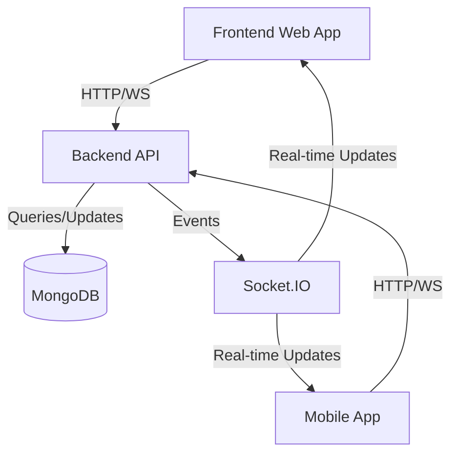

# Architecture Documentation

## System Overview

EuroRide follows a microservices-oriented architecture with three main components:

1. Backend (Node.js/Express)
2. Frontend (React)
3. Mobile App (React Native)



## Backend Architecture

### Layer Structure
1. Routes
2. Controllers
3. Services
4. Models
5. Utils

### Key Features
- JWT Authentication
- Real-time communication (Socket.IO)
- Input validation (Joi)
- Error handling middleware
- Rate limiting
- CORS configuration

## Frontend Architecture

### Component Structure
1. Pages
2. Features
3. Common Components
4. Hooks
5. Services

### State Management
- Redux for global state
- React Context for theme/auth
- Local state for component-specific data

### Key Features
- Responsive design
- Real-time updates
- Map integration
- Form validation
- Error handling

## Mobile Architecture

### Navigation Structure
1. Auth Stack
2. Main Tab Navigator
3. Modal Stack

### State Management
- Redux for global state
- AsyncStorage for persistence
- Context for theme/location

## Security Architecture

### Authentication Flow
1. User login/register
2. JWT token generation
3. Token validation
4. Refresh token mechanism

### Data Protection
1. Input sanitization
2. XSS prevention
3. CSRF protection
4. Rate limiting

## Database Schema

### User Collection
```javascript
{
  _id: ObjectId,
  name: String,
  email: String,
  password: String (hashed),
  createdAt: Date,
  updatedAt: Date
}
```

### Ride Collection
```javascript
{
  _id: ObjectId,
  userId: ObjectId,
  driverId: ObjectId,
  status: String,
  pickup: {
    lat: Number,
    lng: Number,
    address: String
  },
  destination: {
    lat: Number,
    lng: Number,
    address: String
  },
  price: Number,
  createdAt: Date,
  updatedAt: Date
}
```

## Deployment Architecture

### Production Environment
- Backend: Vercel
- Frontend: Netlify
- Database: MongoDB Atlas
- WebSocket: Vercel Serverless

### Development Environment
- Docker containers
- Local MongoDB
- Hot reloading
- Debug configuration
